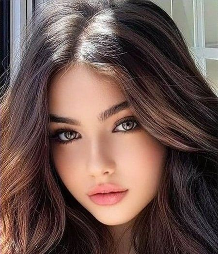
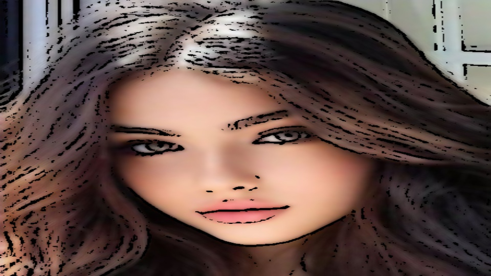
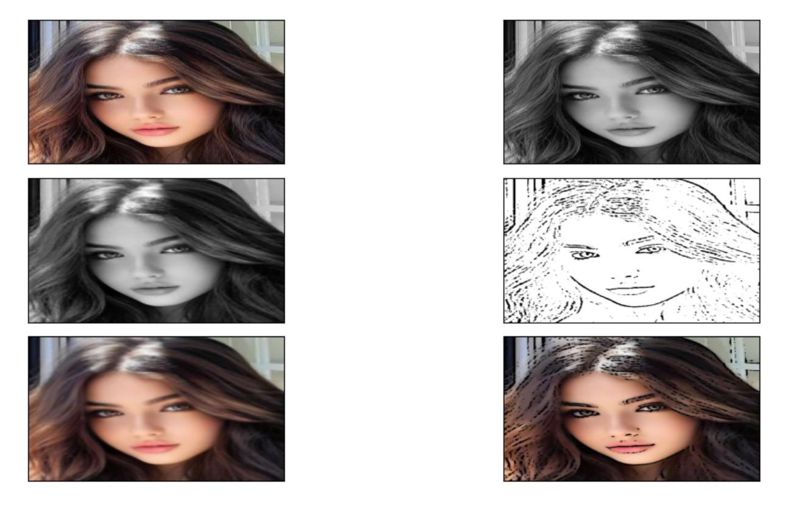

# We-Doodle-You
Has the artist in you ever passed by a beautiful scenery and thought, this must be
sketched but goes south unless you keep all your priority work in the backseat?
People all over the world are hungry and crave creativity. Albeit, the world also offers
a scrunch of time. Our application, “WeDoodleYou” helps you to change images to
cartoons in the blink of an eye. WDY is a fast and precise tool that can be used
everywhere, anywhere. Amazing? Try it out!

## About This Project
Our TASK is to convert a 24 bit image into its cartoon outline.
The EXPERIENCE is a dataset of over thousand celebrity faces of different shapes,
colours, and textures.
Furthermore, the PERFORMANCE is measured by the regression accuracy between
the original image and cartoonified one.

## Motivation
Cartoons have a big impact on how we view the world now.When we were children,
cartoons helped us to understand how things function in real life, explaining more
about feelings and relationships in a way we can understand. Now even though many
of us want to express certain images as their cartoon versions, limitations in artistic
talent leads to frustration. So we decided to develop a machine learning model for
changing images into cartoons, in the blink of an eye.

## Installation
- Fork this repositary
- run `requirements.txt`
```Python
pip install -r requirements.txt
```

## Result
- Original Image


- Modified Image


- Steps involved


## Credit
- https://data-flair.training/blogs/cartoonify-image-opencv-python/
